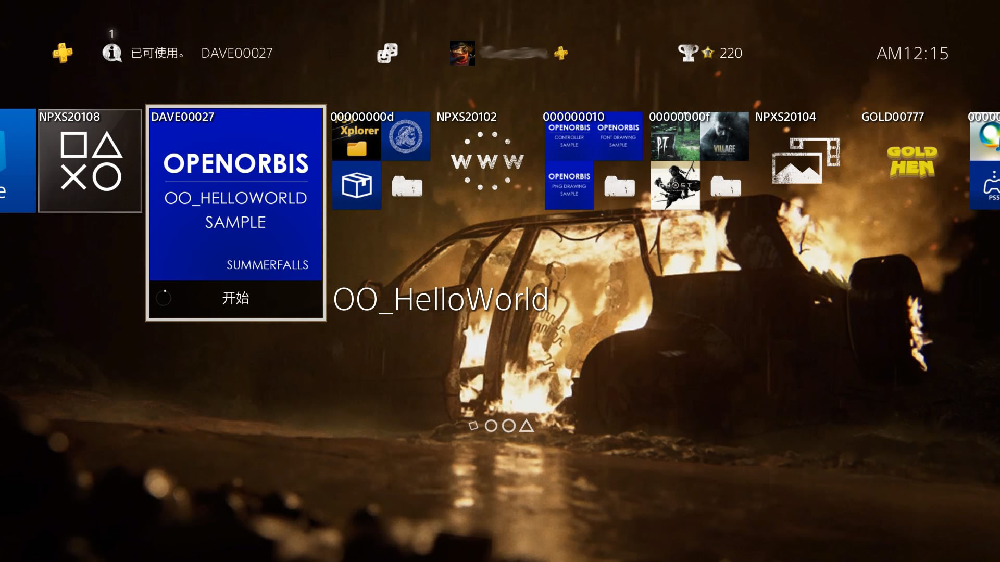
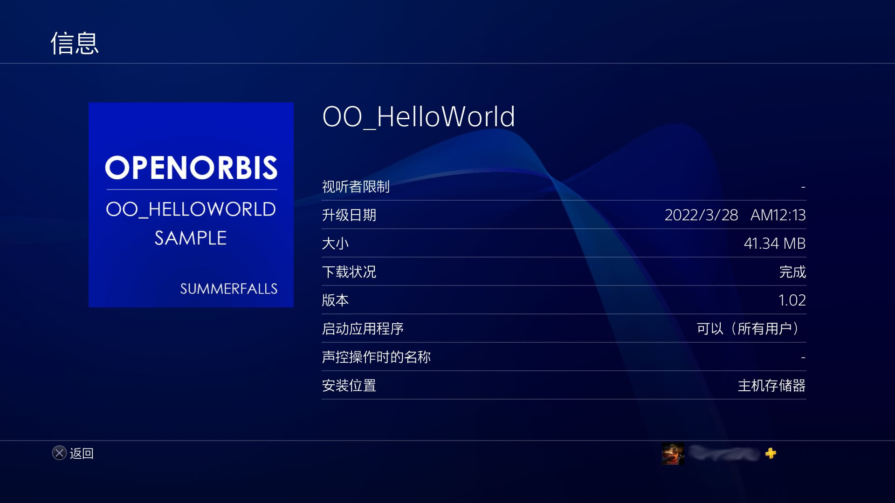

# :beers: OO_HelloWorld

```c
/*
 *          ___           ___           ___           ___                                       ___           ___           ___           ___                        _____
 *         /  /\         /  /\         /__/\         /  /\                                     /  /\         /__/\         /  /\         /  /\                      /  /::\
 *        /  /::\       /  /::\        \  \:\       /  /:/_                                   /  /::\       _\_ \:\       /  /::\       /  /::\                    /  /:/\:\
 *       /  /:/\:\     /  /:/\:\        \__\:\     /  /:/ /\    ___     ___   ___     ___    /  /:/\:\     /__/\ \:\     /  /:/\:\     /  /:/\:\    ___     ___   /  /:/  \:\
 *      /  /:/  \:\   /  /:/  \:\   ___ /  /::\   /  /:/ /:/_  /__/\   /  /\ /__/\   /  /\  /  /:/  \:\   _\_ \:\ \:\   /  /:/  \:\   /  /:/~/:/   /__/\   /  /\ /__/:/ \__\:|
 *     /__/:/ \__\:\ /__/:/ \__\:\ /__/\  /:/\:\ /__/:/ /:/ /\ \  \:\ /  /:/ \  \:\ /  /:/ /__/:/ \__\:\ /__/\ \:\ \:\ /__/:/ \__\:\ /__/:/ /:/___ \  \:\ /  /:/ \  \:\ /  /:/
 *     \  \:\ /  /:/ \  \:\ /  /:/ \  \:\/:/__\/ \  \:\/:/ /:/  \  \:\  /:/   \  \:\  /:/  \  \:\ /  /:/ \  \:\ \:\/:/ \  \:\ /  /:/ \  \:\/:::::/  \  \:\  /:/   \  \:\  /:/
 *      \  \:\  /:/   \  \:\  /:/   \  \::/       \  \::/ /:/    \  \:\/:/     \  \:\/:/    \  \:\  /:/   \  \:\ \::/   \  \:\  /:/   \  \::/~~~~    \  \:\/:/     \  \:\/:/
 *       \  \:\/:/     \  \:\/:/     \  \:\        \  \:\/:/      \  \::/       \  \::/      \  \:\/:/     \  \:\/:/     \  \:\/:/     \  \:\         \  \::/       \  \::/
 *        \  \::/       \  \::/       \  \:\        \  \::/        \__\/         \__\/        \  \::/       \  \::/       \  \::/       \  \:\         \__\/         \__\/
 *         \__\/         \__\/         \__\/         \__\/                                     \__\/         \__\/         \__\/         \__\/
 *
 */
```

## :book: 简介

本程序为一个简单的 PS4 自制示例程序，仅作 PS4 自制程序开发构建的演示用途。程序运行后会弹出若干条通知信息。

<div style="margin: 0 auto; width: 50%;">






</div>

## :gear: 环境

- [Open Orbis Toolchain][Open Orbis Toolchain]
- [notifi][notifi]

[Open Orbis Toolchain]: https://github.com/OpenOrbis/OpenOrbis-PS4-Toolchain
[notifi]: https://github.com/Al-Azif/ps4-notifi
